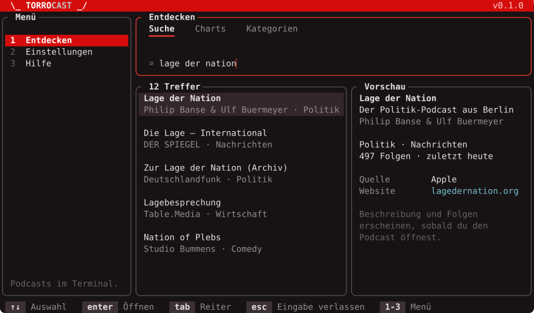
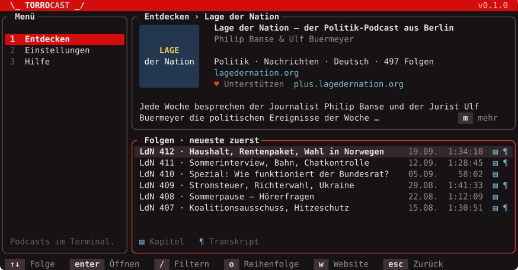
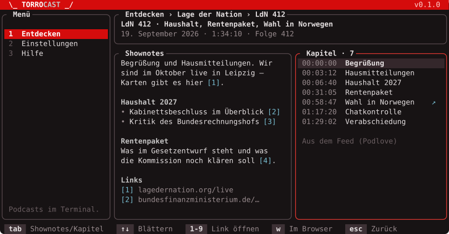
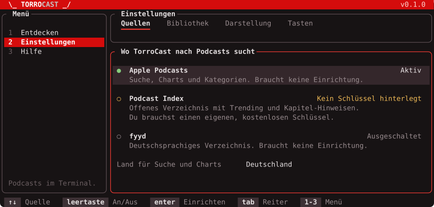
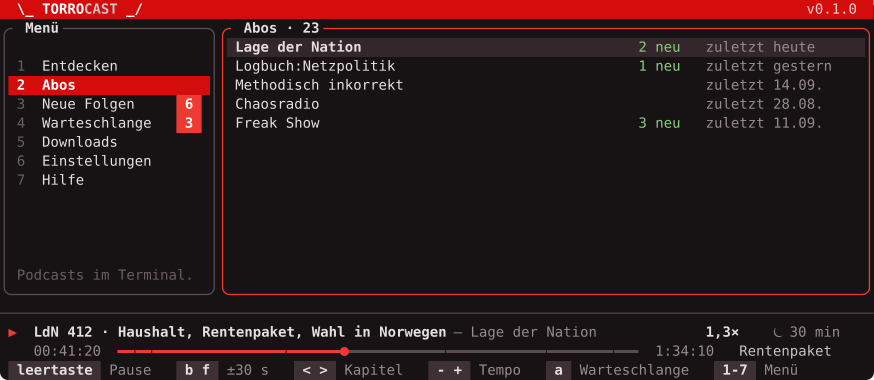

# Oberfläche

Entwurf für die TUI. Ausgangspunkt sind die TorroMail-TUI (`crates/torromail-tui`) und
die Designsprache der Torro-Apps (`torro-design/app-design.md`). TorroCast soll als
Mitglied derselben Familie erkennbar sein: gleicher Rahmen, gleiche Farben, gleiche
Bedienung – nur der Inhalt wechselt.

Die Mockups zeigen die Farben aus TorroMails `theme.rs` auf einem dunklen Terminal, 104
Spalten breit. Sie entstehen aus [`tools/mockups.py`](tools/mockups.py); nach einer
Änderung dort `python3 docs/tools/mockups.py` ausführen.

## Farben

| Farbe | Wert | Wofür |
|---|---|---|
| Torro-Rot | `#D50C0C` | Markenleiste, aktiver Menüeintrag – sonst nirgends |
| Akzent | `#EE3A33` | Rand des Panels mit Fokus, aktiver Reiter, Eingabemarke, Fortschrittsbalken, Zähler am Menü |
| Silber | `#C4C3C3` | Produktname in der Wortmarke, Zwischenüberschriften in Shownotes |
| Gedämpft | `#978A8D` | zweite Zeile eines Eintrags, Datum, Dauer, Beschriftungen |
| Blass | `#6A5E61` | Menüziffern, Claim, Hinweise in leeren Flächen |
| Linie | `#5A4C50` | Panel-Ränder ohne Fokus |
| Auswahl | `#34272B` | Hintergrund der gewählten Zeile, dazu fett |
| Taste | `#3D3135` | Kacheln in der Tastenzeile |
| Cyan | `#79BFD3` | alles, was sich öffnen lässt: Links, Linknummern, Kapitel- und Transkript-Zeichen |
| Grün | `#86CF7D` | in Ordnung: Quelle aktiv, neue Folgen |
| Amber | `#ECB755` | wartet auf dich: Schlüssel fehlt |

Neu gegenüber TorroMail ist nur die feste Rolle von Cyan für Links. Der Hintergrund
bleibt der des Terminals.

## Was von TorroMail übernommen wird

| Baustein | TorroMail | TorroCast |
|---|---|---|
| Markenleiste oben | rote Zeile, Wortmarke `\_ TORROMAIL _/` („TORRO“ weiß, Produktname silber), Version rechts | identisch, `\_ TORROCAST _/` |
| Menü links | 26 Spalten, nummerierte Einträge, aktiver Eintrag rot hinterlegt, Claim am Fuß | identisch |
| Inhalt rechts | abgerundete Panels; das Panel mit dem Fokus trägt den Akzentrand | identisch |
| Reiter im Inhalt | `tab` / `shift+tab` | identisch |
| Tastenzeile unten | Tasten als kleine Kacheln, daneben das Wort | identisch, wechselt je Ansicht |
| Farbpalette | `theme.rs`: Torro-Rot, Silber, gedämpfte Grautöne, Grün/Amber/Cyan für Status | unverändert übernehmen |
| Hintergrund | bleibt der des Terminals | identisch |
| Sprache | Deutsch und Englisch nach `LANG`; englischer Text ist der Schlüssel | identisch |
| Tests | Render-Tests gegen `TestBackend` | identisch, plus Snapshots mit `insta` |

Neu gegenüber TorroMail sind drei Dinge: ein **Eingabefeld** (Suche), eine
**Hierarchie zum Hineingehen** (Suche → Podcast → Folge) und ab v0.2 die
**Wiedergabeleiste**.

## Haltung

Aus `app-design.md`, übertragen aufs Terminal:

1. **Rot ist Marke, nie Status.** Rot erscheint in der Markenleiste und am aktiven
   Menüeintrag. Der Fokusrand nutzt den helleren Akzent. Zustände tragen Grün (in
   Ordnung), Amber (wartet auf dich), Grau (nicht eingerichtet) – und **immer Symbol
   plus Wort**, nie die Farbe allein: `● Aktiv`, `○ Ausgeschaltet`, `▲ Nicht erreichbar`.
2. **Ein lauter Markenmoment.** Das ist die rote Leiste. Alles darunter bleibt ruhig.
3. **Sätze aus Sicht des Nutzers.** „Apple antwortet gerade nicht. Du siehst die
   Treffer von fyyd.“ statt „HTTP 503“. Technische Details gehören ins Log.
4. **Fehler stehen dort, wo sie entstehen** – als Zeile im betroffenen Panel, nicht als
   Dialog, der die Bedienung blockiert.
5. **Leere Flächen sagen, was hier erscheinen wird.** „Noch keine Suche. Tippe `/` und
   einen Begriff, oder wechsle zu den Charts.“
6. **Listen sind Kartenlisten.** Ein Eintrag hat zwei Zeilen: Titel, darunter gedämpft
   die Nebeninformation. Tabellen gibt es nur dort, wo Spalten wirklich helfen
   (Folgenliste: Datum und Dauer).

## Rahmen und Bedienmodell

### Zwei Modi

TorroMail kennt nur Befehlstasten. Mit einem Suchfeld braucht es eine klare Trennung:

- **Navigieren** (Normalzustand): Jede Taste ist ein Befehl. `1`–`7` wechselt das
  Menü, `j`/`k` bewegt die Auswahl.
- **Eingeben**: Das Suchfeld hat den Fokus und den Akzentrand, alle Zeichen landen im
  Feld. `esc` oder `↓` verlässt das Feld, `enter` startet die Suche sofort.

`/` springt von überall ins Suchfeld. In Listen ohne Suchfeld (Folgen) filtert `/` die
Liste.

### Hineingehen und zurück

`enter` oder `→` öffnet den gewählten Eintrag, `esc`, `←` oder `backspace` geht eine
Ebene zurück. Der Pfad steht im Panel-Titel: `Entdecken › Lage der Nation › LdN 412`.
Beim Zurückgehen steht die Auswahl dort, wo sie war.

### Tasten

| Taste | Wirkung |
|---|---|
| `↑` `↓` / `j` `k` | Auswahl bewegen |
| `bild↑` `bild↓`, `pos1` `ende` / `g` `G` | blättern, Anfang, Ende |
| `enter` / `→` / `l` | öffnen |
| `esc` / `←` / `h` / `backspace` | zurück |
| `tab` / `shift+tab` | Reiter oder Panel wechseln |
| `/` | suchen oder filtern |
| `1`–`7` | Menü |
| `o` | Reihenfolge umkehren |
| `w` | im Browser öffnen |
| `1`–`9` in Shownotes | nummerierten Link öffnen |
| `m` | Beschreibung aufklappen |
| `r` | neu laden |
| `?` | alle Tasten |
| `q` / `ctrl+c` | beenden |

Alle Befehle kommen ohne ungewöhnliche Modifier aus; das hält die Belegung unter
Windows verlässlich. Die Maus funktioniert zusätzlich: Klick wählt, Doppelklick öffnet,
das Rad blättert, Menü und Reiter sind anklickbar.

Ab v0.2, solange etwas läuft: `leertaste` Pause, `b` / `f` 30 s zurück / vor, `<` / `>`
Kapitel, `-` / `+` Tempo, `a` in die Warteschlange, `s` abonnieren.

### Breite

| Terminalbreite | Verhalten |
|---|---|
| ab 100 Spalten | Menü + zwei Panels nebeneinander (Liste und Vorschau) |
| 80–99 | Menü + ein Panel; die Vorschau entfällt, `enter` öffnet direkt |
| unter 80 | Menü schrumpft auf die Ziffernspalte |
| unter 60 × 16 | Hinweis „Das Fenster ist zu klein“ statt zerbrochener Darstellung |

## Ansichten v0.1

### Entdecken › Suche

- Drei Reiter: **Suche**, **Charts** (Apple-Top-Liste des eingestellten Landes),
  **Kategorien** (Apple-Genres; `enter` zeigt die Charts der Kategorie).
- Die Suche startet 600 ms nach dem letzten Tastendruck und ab drei Zeichen, mit
  `enter` sofort. Das hält das Apple-Limit von rund 20 Anfragen pro Minute ein.
- Sind mehrere Quellen aktiv, erscheinen Treffer, sobald die erste Quelle antwortet.
  Der Panel-Titel zeigt den Stand: `12 Treffer · fyyd lädt noch`.
- Die Vorschau zeigt nur, was die Quelle schon geliefert hat. Kein Feed-Abruf, solange
  man nur durch die Liste blättert.

### Podcast

- Kopf mit Cover, Titel, Autor, Kategorien, Sprache, Website und
  Unterstützungs-Link. Die Beschreibung ist auf zwei Zeilen gekürzt, `m` klappt sie auf.
- **Cover:** echtes Bild, wenn das Terminal es kann (Kitty, Sixel, iTerm2), sonst
  Block-Zeichen. In den Einstellungen abschaltbar; dann rückt der Text nach links.
- Folgenliste mit Datum, Dauer und Kennzeichen für Kapitel (`▤`) und Transkript (`¶`).
  Die Legende steht unter der Liste, die Zeichen erklären sich nicht von selbst.
- Während der Feed lädt: Kopf aus den Suchdaten, in der Liste „Lade Folgen …“.

### Folge

- Links die Shownotes als lesbarer Text: Absätze, Zwischenüberschriften, Listen. Links
  werden nummeriert und unten aufgelistet; die Ziffer öffnet den Link.
- Rechts die Kapitel. `↗` heißt: Das Kapitel hat einen Link. Unter der Liste steht die
  Herkunft („Aus dem Feed“, „Aus der Audiodatei“). Eingebettete Kapitel werden erst
  beim Öffnen der Folge geholt; solange steht dort „Suche Kapitel in der Audiodatei …“.
- Ohne Kapitel nehmen die Shownotes die volle Breite ein.
- `tab` wechselt den Fokus zwischen Shownotes und Kapiteln.

### Einstellungen › Quellen

- Apple ist immer aktiv und lässt sich nicht abschalten, solange keine andere Quelle
  aktiv ist.
- `enter` auf Podcast Index öffnet ein kleines Formular für Schlüssel und Secret, mit
  dem Hinweis, wo man beides kostenlos bekommt. Beim Speichern wird die Verbindung
  geprüft; der Zustand wechselt auf `● Aktiv` oder `▲ Schlüssel wird nicht angenommen`.
  Der Schlüssel liegt im Schlüsselbund des Betriebssystems und wird in der Oberfläche
  maskiert angezeigt.
- Weitere Reiter: **Bibliothek** (ab v0.2: Ordner wählen, bekannte Geräte),
  **Darstellung** (Cover an/aus, Sprache), **Tasten**.

## Rahmen ab v0.2

- Das Menü wächst auf sieben Einträge, wie bei TorroMail. **Neue Folgen** und
  **Warteschlange** tragen einen Zähler am Eintrag, sobald etwas darin liegt.
- Die **Wiedergabeleiste** sitzt über der Tastenzeile und ist nur sichtbar, wenn etwas
  geladen ist. Zeile eins: Zustand, Folge, Podcast, rechts Tempo und Schlaf-Timer.
  Zeile zwei: Position, Fortschrittsbalken mit Kapitelgrenzen (`┿`), Dauer, aktuelles
  Kapitel.
- Der Fortschrittsbalken ist die eine Stelle im Inhalt, an der der Akzent als Fläche
  auftritt.

## Offene Fragen

| # | Frage | Vorschlag |
|---|---|---|
| 1 | Gemeinsame TUI-Bausteine (Palette, Panel, Tastenzeile, Menü, Sprachumschaltung) für TorroMail und TorroCast: kopieren oder eigenes Crate? | Für v0.1 kopieren. Sobald beide TUIs stabil sind, ein gemeinsames Crate `torro-tui` herausziehen – erst dann ist klar, was wirklich gemeinsam ist. |
| 2 | Menü in v0.1: nur die drei vorhandenen Einträge oder schon alle sieben, die kommenden ausgegraut? | Nur die vorhandenen. Ausgegraute Einträge versprechen etwas, das noch nicht da ist. |
| 3 | Befehlszeile mit `:` wie in podliner (`:open <url>`)? | Nicht in v0.1. „Feed-URL öffnen“ geht über das Suchfeld: Eine eingegebene URL wird als Feed geöffnet. |
| 4 | Cover in der Trefferliste? | Nein, nur im Podcast-Kopf. Viele kleine Bilder machen das Blättern träge. |
| 5 | Helles Terminal: Die TorroMail-Palette ist auf dunklen Grund abgestimmt. | In v0.1 wie TorroMail; ein helles Schema später für beide gemeinsam. |
